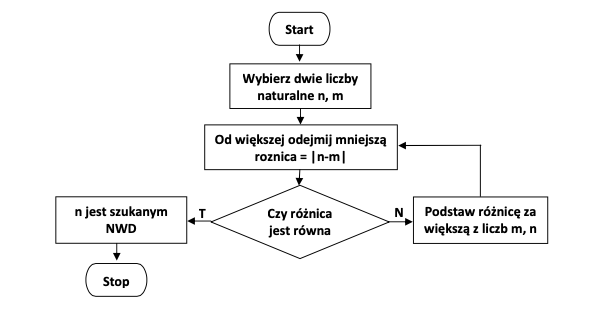
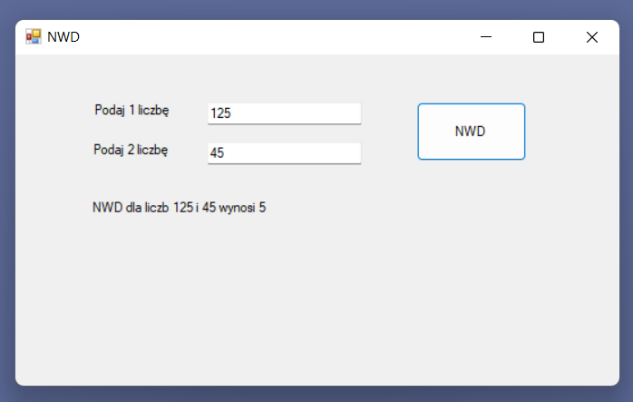

# NWD
Greatest common measure calculation

## Table of Contents
* [General Info](#general-information)
* [Technologies Used](#technologies-used)
* [Features](#features)
* [Setup](#setup)
* [Usage](#usage)
* [Project Status](#project-status)
* [Room for Improvement](#room-for-improvement)
* [Acknowledgements](#acknowledgements)
* [Contact](#contact)

## General Information
The format application finds the greatest common divisor of two natural numbers. This problem is solved by Euclid's algorithm.

## Technologies Used
Microsoft Visual Studio Community 2022
Version 17.2.1
VisualStudio.17.Release/17.2.1+32516.85
Microsoft .NET Framework
Version 4.8.04161

Installed version: Community

C# tools  4.2.0-4.22252.24
C# components used in the IDE. Depending on the type of project and its settings, a different version of the compiler may be used.

## Features
The algorithm does not require decomposing numbers into prime factors. Interestingly, the algorithm was not invented by Euclid, but by Eudoxus of Knidos, a Greek philosopher and mathematician.
Euclid only included the algorithm in his work Elements. The date of the creation of the algorithm is around 300 BC. 
Here comes the processing logic:

## Setup
The project requires Visual Studio with C# components to be installed on a local machine for compilation.

## Usage
The usage is self-explanatory, as illustrated by this screenshot:

## Project Status
Project is: _no longer being worked on_. 

## Room for Improvement
Ability to calculate the greatest common measure of more than two numbers.

## Acknowledgements
- This project was inspired by mgr Piotr Porzuczek. Credits should be also given to Eudoxus of Knidos and Euclid :) 

## Contact
Created by Zosiasg@gmail.com - feel free to contact me!
